## Task Loco
Project Task organizer with appropriate task statuses and team member management for each project

## Front End
An iOS mobile application leveraging API powered by MongoDB database

### Mobile Application
- Provide full functionality to create tasks and organize tasks within a project
- Written in Swift 5
- Leverage libraries like  RxSwift and Almofire for networking and asynchronous operation

### Video

### Screenshots
| Login | Sign Up|
|-------|--------|
|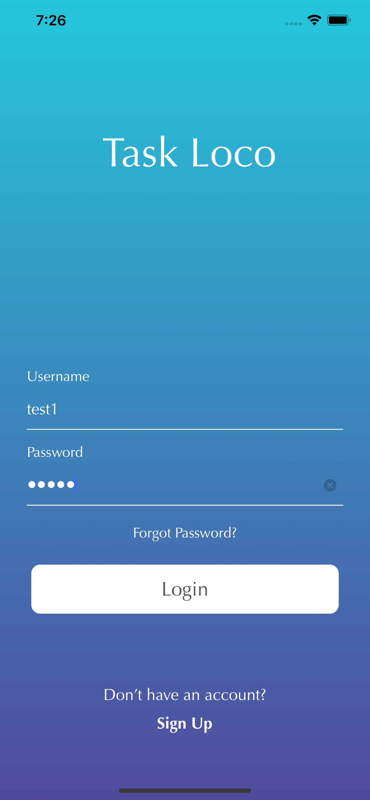|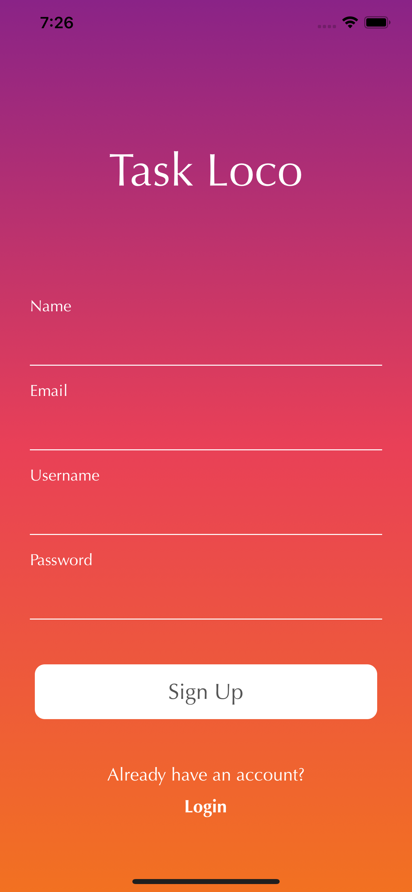|

|Project|User Details|
|-------|------|
|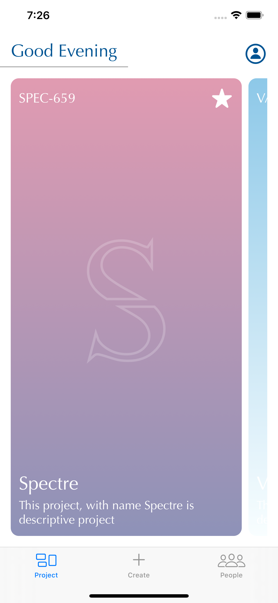|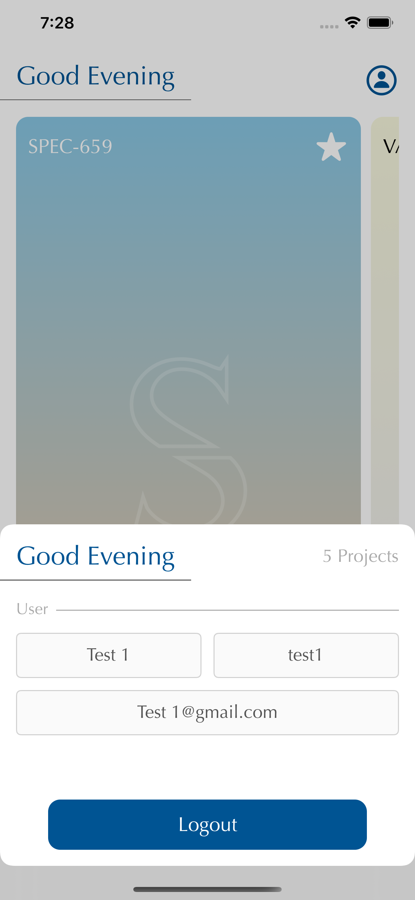|

|Create Project|Add Member|
|-------|------|
|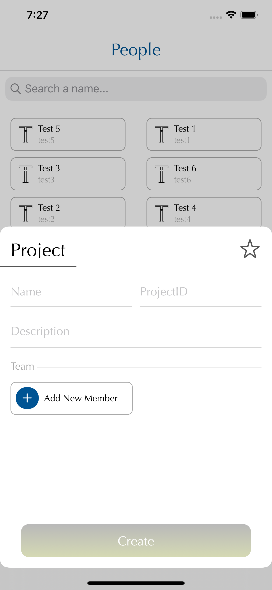|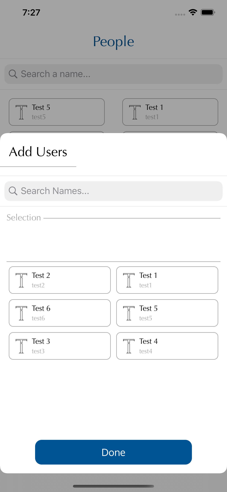|

|People|People Detail|
|-------|------|
|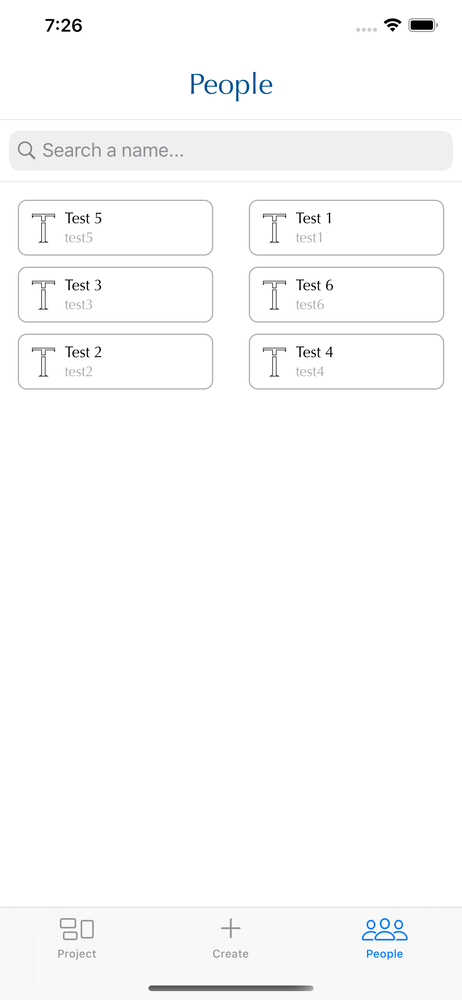|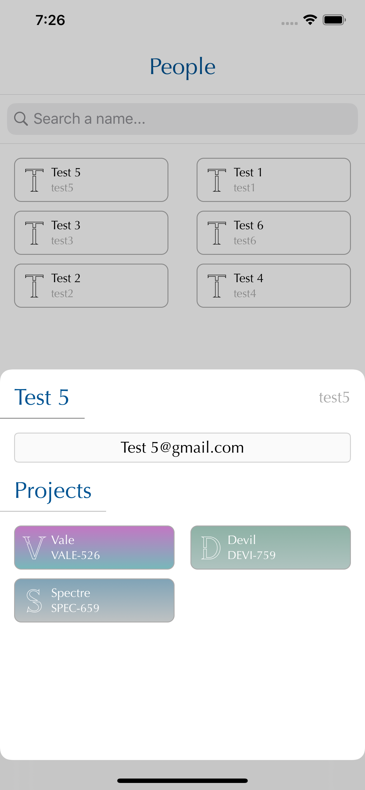|

|User Tasks|Task Detail|
|-------|------|
|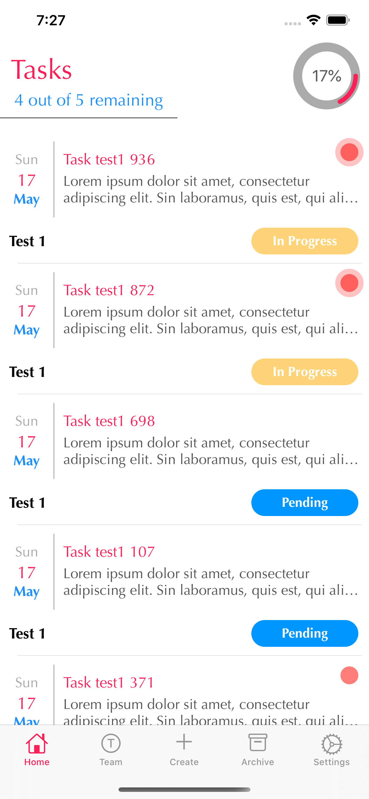|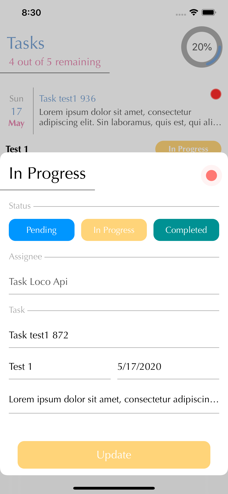|

|Team Task|Team Filter|Team Filter Result|
|-------|------|------|
|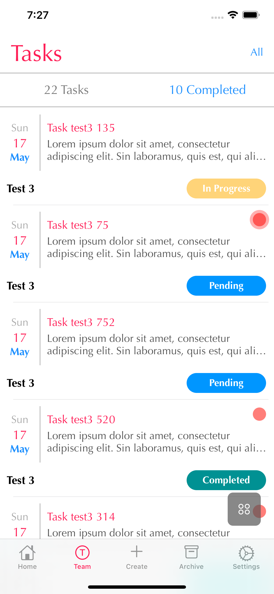|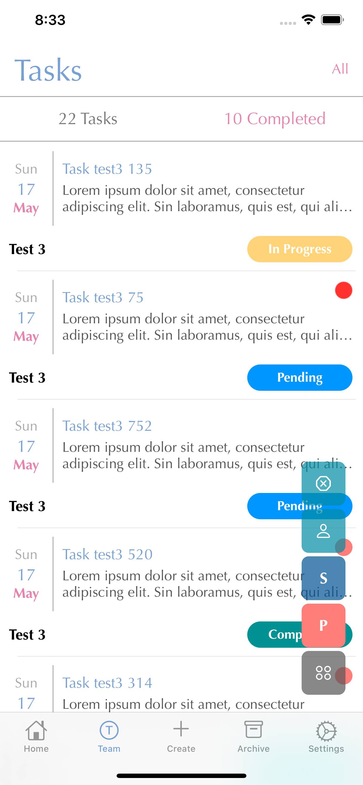|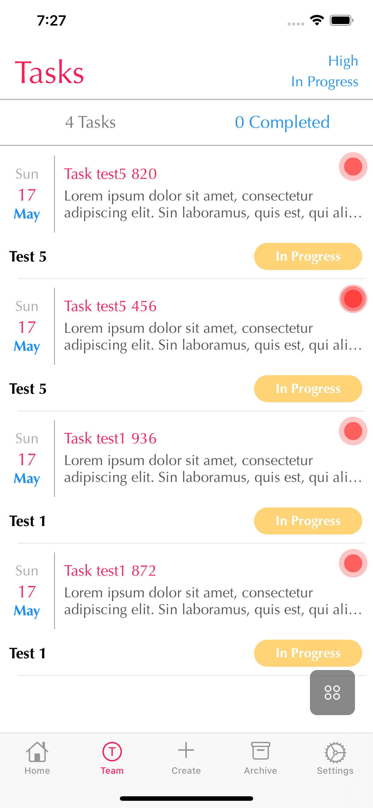|

|Create Pending|Create InProgress|Create Completed
|-------|------|-----|
|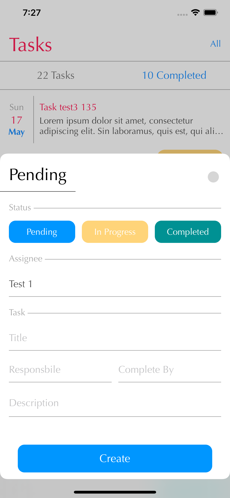|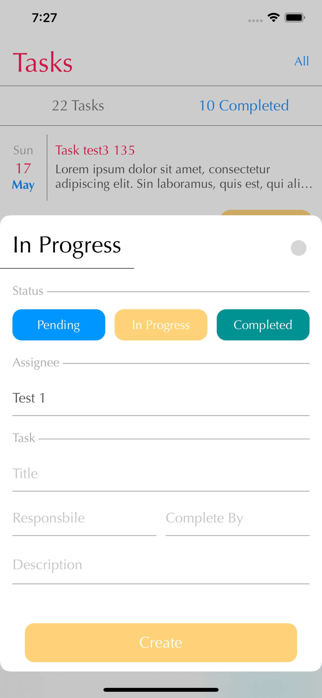|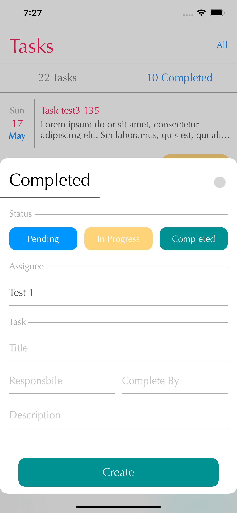|

|Archive Tasks|Archive Detail|
|-------|------|
|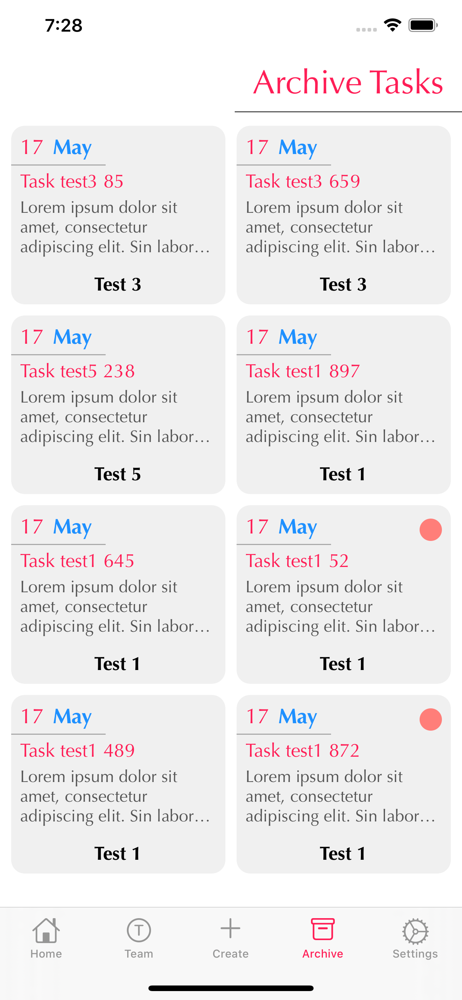|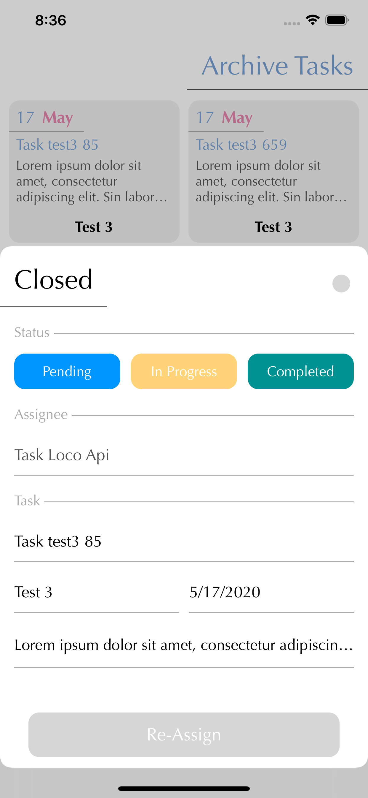|

|Settings|Add Member|
|-------|------|
||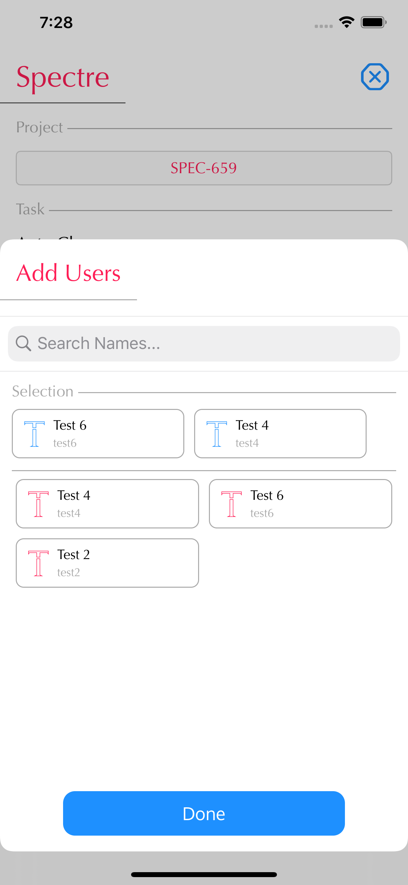|

## Backend
An API leveraging MongoDb as database 

### API
- Powered by NodeJS
- Relies on local Database to store and fetch data
- Will support CRUD operation for each endpoint

#### User Endpoints
| Type   | Prefix | Endpoint    | Description                                          |
|--------|--------|-------------|------------------------------|
| POST   | /user  | /           | Create a user from JSON request body            |
| GET    | /user  | /names      | Provide all user names                          |
| POST    | /user  | /login      | Validates the user and provide a token         |
| POST | /user | /logout | Logout out the provided user in body					  |
| GET | /user | /project/:username |Provide all projects associated with username |
| GET    | /user  | /:username | Provide all information associated with the username |
| DELETE | /user  | /:username | Delete the user with associated username         |

#### Project Endpoints
| Type   | Prefix | Endpoint         | Description                                                                                              |
|--------|--------|------------------|----------------------------------------------------------------------------------------------------------|
| POST  | /project  | / | Create a Project from JSON request body |
| GET   | /project  | /all | Provide all Projects    |
| POST  | /project  | /add/:projectId | Add member to project associated with  project ID |
| POST   | /project  | /remove/:projectId | Remove member from project associated with project ID | 
| POST    | /project  | /update/:projectId | Update project associated with project ID based on JSON Body |
| GET    | /project  | /id/:projectId  | Provide project associated with project ID |
| GET | /project | /:username | Provide all project associated with username |
| DELETE | /project  | /:project | Remove the project associated with the project ID |

#### Task Endpoints
| Type   | Prefix | Endpoint         | Description                                                                                              |
|--------|--------|------------------|----------------------------------------------------------------------------------------------------------|
| POST   | /task  | / | Create a task from JSON request body |
| POST   | /task  | /:taskId | Update task associated task ID, with JSON Body    |
| GET    | /task  | /all        | Provide all the tasks           |
| GET    | /task  | /user/:username | Provide all tasks associated with username | 
| GET    | /task  | /filter       | Provide filtered task based on JSON Body |
| GET    | /task  | /archive         | Provide all the archived tasks |
| DELETE | /task  | /:taskId        | Remove the task associated with the task ID |

## Run
### Api
- Download the project and open in your favorite IDE
- Start mongoDB with `mongodb --dbpath <db-path>`
- Uncomment `testData.initData();` to create test data in mongoDB
- Start API with `npm start`

### Mobile Application
- Open project in Xcode
- Run with your desired simulator or directly on device
